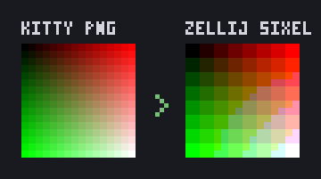
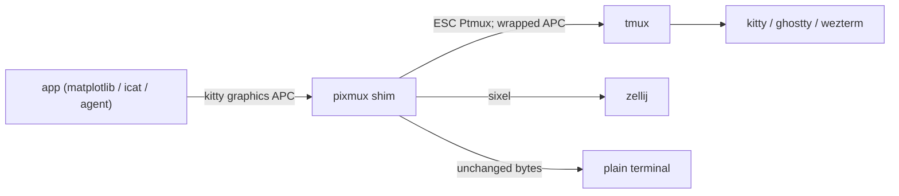

# pixmux

[English](README.md) | [中文](README.zh.md) | [日本語](README.ja.md)

[](LICENSE) [](https://github.com/JaydenCJ/pixmux/releases) [](https://www.rust-lang.org) [](https://github.com/JaydenCJ/pixmux/discussions)

**オープンソースの single-binary shim。kitty graphics protocol の画像を tmux と zellij 越しに表示できます。**



```bash
git clone https://github.com/JaydenCJ/pixmux && cargo install --path pixmux
```

## なぜ pixmux なのか

ターミナルで直接画像を描くプログラムは増え続けています。matplotlib のターミナルバックエンド、`kitty +kitten icat`、notcurses 系アプリ、そしてグラフを shell に直接出力する AI coding agent などです。ところが multiplexer の中に入った瞬間、画像は表示されなくなります。tmux は upstream で kitty graphics protocol の実装を明確に断っており、kitty graphics 対応は zellij で最も票を集めている open issue（[#2814](https://github.com/zellij-org/zellij/issues/2814)）のままです。pixmux はプログラムと multiplexer の間に入る透過的な shim として、kitty graphics をその場で再エンコードします。tmux には passthrough ラップ、zellij には sixel への変換を行い、それ以外のバイトには一切手を触れません。

|  | pixmux | 手動の `\ePtmux;` パッチ | 素の zellij |
|---|---|---|---|
| tmux 内での kitty graphics 表示 | yes（自動ラップ + 再チャンク） | パッチ済みアプリのみ | n/a |
| zellij 内での kitty graphics 表示 | yes（sixel へ変換） | no | no（issue #2814 は 2023 年から未解決） |
| 画像を出す側のアプリの変更 | none | すべてのアプリで必要 | n/a |
| 分割送信（`m=1`）の処理 | yes | no | n/a |
| 非グラフィックスのバイトの改変 | never | never | never |

## 特徴

- **アプリ変更ゼロ** — `pixmux run -- <command>` が任意のプログラムを PTY で包み、グラフィックス出力をリアルタイムに変換します。プログラム側は何も意識しません。
- **正しい tmux passthrough** — シーケンスを ESC 二重化した `ESC Ptmux;` DCS で包み、大きすぎる単発送信は kitty 仕様の 4096 バイトチャンクに再分割します。
- **sixel 経由の zellij 対応** — PNG、raw RGB/RGBA、zlib 圧縮、分割送信の kitty transmission をデコードし、zellij がネイティブに描画できる sixel へ再エンコードします。run モードでは `a=q` の capability クエリにも応答し、アプリ側のグラフィックスバックエンドを有効にします。
- **バイト単位の透過** — kitty graphics 以外の内容は不正・途中切断された入力も含めてそのまま転送します。パーサーは実際の emitter の出力形式（`kitty +kitten icat` 形式）を再現した合成 wire-format ストリームを、任意のバイト境界で分割してテストしています。
- **パイプラインに強い** — `filter` は stdin から stdout へのストリーム変換、`cat` はどの multiplexer の中でも PNG を表示、`doctor` は環境設定を診断します。
- **daemon なし・設定なし** — コマンドごとに 1 プロセスだけ。対象は `$TMUX` / `$ZELLIJ` から自動判定します。

## クイックスタート

インストール:

```bash
git clone https://github.com/JaydenCJ/pixmux && cargo install --path pixmux
```

最小の例を実行します:

```bash
printf 'plot:\033_Ga=T,f=100;QUJD\033\\\n' | pixmux filter --target tmux | cat -v
```

出力:

```text
plot:^[Ptmux;^[^[_Ga=T,f=100;QUJD^[^[\^[\
```

kitty graphics シーケンスが tmux passthrough でラップされ、前後のテキストはそのまま残ります。実際のセッションでは次のように使います:

```bash
tmux set -gq allow-passthrough on   # once, tmux >= 3.3
pixmux run -- python3 plot.py       # any program that emits kitty graphics
pixmux doctor                       # diagnose your terminal/multiplexer setup
```

## アーキテクチャ



## ロードマップ

- [x] tmux passthrough と zellij sixel の 2 ターゲット + wire-format サンプルのテストスイート（v0.1.0）
- [ ] tmux 内の pane を意識したクリッピングと scrollback 処理
- [ ] Unicode placeholder 配置（`U=1`）によるセル単位の安定表示
- [ ] アニメーションフレーム（`a=f`）と共有メモリ送信（`t=s`）
- [ ] 実際の tmux / zellij / kitty の組み合わせに対する統合テストマトリクス

全体は [open issues](https://github.com/JaydenCJ/pixmux/issues) を参照してください。

## コントリビューション

コントリビューションを歓迎します。まずは [good first issue](https://github.com/JaydenCJ/pixmux/issues?q=is%3Aissue+is%3Aopen+label%3A%22good+first+issue%22) から、または [Discussions](https://github.com/JaydenCJ/pixmux/discussions) でお気軽にどうぞ。開発環境の構築は [CONTRIBUTING.md](CONTRIBUTING.md) を参照してください。

## ライセンス

[MIT](LICENSE)
