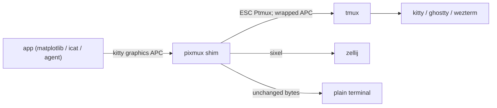

# pixmux

[English](README.md) | [中文](README.zh.md) | [日本語](README.ja.md)

[](LICENSE) [](https://github.com/JaydenCJ/pixmux/releases) [](https://www.rust-lang.org) [](https://github.com/JaydenCJ/pixmux/discussions)

**Open-source, single-binary shim that lets kitty graphics protocol images survive tmux and zellij.**


```bash
git clone https://github.com/JaydenCJ/pixmux && cargo install --path pixmux
```

## Why pixmux?

Terminal programs increasingly draw real images: matplotlib's terminal backends, `kitty +kitten icat`, notcurses apps, and AI coding agents that plot charts straight into your shell. The moment you run them inside a multiplexer, the image dies: tmux upstream declined to implement the kitty graphics protocol, and kitty graphics support is zellij's highest-voted open issue ([#2814](https://github.com/zellij-org/zellij/issues/2814)). pixmux sits between your program and the multiplexer as a transparent shim: it re-encodes kitty graphics on the fly — tmux passthrough wrapping for tmux, sixel transcoding for zellij — while every other byte passes through untouched.

|  | pixmux | manual `\ePtmux;` patching | stock zellij |
|---|---|---|---|
| kitty graphics inside tmux | yes (auto-wrap + re-chunk) | only in apps patched per-tool | n/a |
| kitty graphics inside zellij | yes (transcoded to sixel) | no | no (issue #2814 open since 2023) |
| Changes required in the emitting app | none | every emitter | n/a |
| Chunked transmissions (`m=1`) handled | yes | no | n/a |
| Non-graphics bytes altered | never | never | never |

## Features

- **Zero app changes** — `pixmux run -- <command>` wraps any program in a PTY and translates its graphics output live; the program never knows.
- **tmux passthrough done right** — sequences are wrapped in ESC-doubled `ESC Ptmux;` DCS, and oversized single transmissions are re-chunked to the kitty spec's 4096-byte chunks.
- **zellij support via sixel** — PNG, raw RGB/RGBA, zlib-compressed and chunked kitty transmissions are decoded and re-encoded as sixel, which zellij renders natively; `a=q` capability queries are answered in run mode so probing apps enable their graphics backend.
- **Byte-exact passthrough** — everything that is not a kitty graphics sequence is forwarded verbatim, malformed or truncated input included; the parser is tested against synthetic wire-format streams that reproduce real emitter output (`kitty +kitten icat` format), split at arbitrary byte boundaries.
- **Pipeline friendly** — `filter` translates stdin to stdout for pipes and logs, `cat` displays a PNG through whatever multiplexer you are in, `doctor` diagnoses your setup.
- **No daemon, no config** — a single process per command, target auto-detected from `$TMUX` / `$ZELLIJ`.

## Quickstart

Install:

```bash
git clone https://github.com/JaydenCJ/pixmux && cargo install --path pixmux
```

Run the minimal example:

```bash
printf 'plot:\033_Ga=T,f=100;QUJD\033\\\n' | pixmux filter --target tmux | cat -v
```

Output:

```text
plot:^[Ptmux;^[^[_Ga=T,f=100;QUJD^[^[\^[\
```

The kitty graphics sequence is now wrapped for tmux passthrough; the surrounding text is untouched. In a real session:

```bash
tmux set -gq allow-passthrough on   # once, tmux >= 3.3
pixmux run -- python3 plot.py       # any program that emits kitty graphics
pixmux doctor                       # diagnose your terminal/multiplexer setup
```

## Architecture



## Roadmap

- [x] tmux passthrough + zellij sixel targets with a wire-format sample test suite (v0.1.0)
- [ ] Pane-aware clipping and scrollback handling inside tmux
- [ ] Unicode placeholder placements (`U=1`) for cell-stable positioning
- [ ] Animation frames (`a=f`) and shared-memory transmissions (`t=s`)
- [ ] Integration test matrix against real tmux / zellij / kitty builds

See the [open issues](https://github.com/JaydenCJ/pixmux/issues) for the full list.

## Contributing

Contributions are welcome — start with a [good first issue](https://github.com/JaydenCJ/pixmux/issues?q=is%3Aissue+is%3Aopen+label%3A%22good+first+issue%22) or open a [discussion](https://github.com/JaydenCJ/pixmux/discussions). Development setup lives in [CONTRIBUTING.md](CONTRIBUTING.md).

## License

[MIT](LICENSE)
