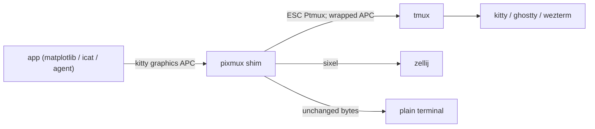

# pixmux

[English](README.md) | [中文](README.zh.md) | [日本語](README.ja.md)

[](LICENSE) [](https://github.com/JaydenCJ/pixmux/releases) [](https://www.rust-lang.org) [](https://github.com/JaydenCJ/pixmux/discussions)

**开源的 single-binary shim：让 kitty graphics protocol 图像穿透 tmux 与 zellij。**


```bash
git clone https://github.com/JaydenCJ/pixmux && cargo install --path pixmux
```

## 为什么是 pixmux？

越来越多的终端程序会直接画图：matplotlib 的终端后端、`kitty +kitten icat`、notcurses 应用，以及把图表直接输出到 shell 里的 AI coding agent。可一旦进了 multiplexer，图像就没了：tmux 上游明确拒绝实现 kitty graphics protocol，而 kitty graphics 支持是 zellij 得票最高的 open issue（[#2814](https://github.com/zellij-org/zellij/issues/2814)）。pixmux 作为透明 shim 夹在程序与 multiplexer 之间，实时重编码 kitty graphics——对 tmux 做 passthrough 包裹，对 zellij 转码为 sixel——其余字节原样通过，一个都不动。

|  | pixmux | 手工 `\ePtmux;` 补丁 | 原生 zellij |
|---|---|---|---|
| tmux 内显示 kitty graphics | yes（自动包裹 + 重分块） | 仅限逐个打过补丁的应用 | n/a |
| zellij 内显示 kitty graphics | yes（转码为 sixel） | no | no（issue #2814 自 2023 年挂起） |
| 需要修改发图应用 | none | 每个应用都要改 | n/a |
| 处理分块传输（`m=1`） | yes | no | n/a |
| 非图形字节是否被改动 | never | never | never |

## 特性

- **应用零改动** —— `pixmux run -- <command>` 用 PTY 包住任意程序，实时翻译其图形输出；程序毫无感知。
- **tmux passthrough 做到位** —— 序列被包进 ESC 加倍的 `ESC Ptmux;` DCS；超大的单次传输会按 kitty 规范重新切成 4096 字节分块。
- **通过 sixel 支持 zellij** —— PNG、raw RGB/RGBA、zlib 压缩及分块的 kitty 传输被解码后重编码为 zellij 原生支持的 sixel；run 模式下还会应答 `a=q` 能力探测，让应用主动启用图形后端。
- **字节级透传** —— 一切非 kitty graphics 的内容逐字节转发，畸形或截断的输入也不例外；解析器用还原真实发图程序线上格式（`kitty +kitten icat` 格式）的合成字节流，在任意切分点下做过测试。
- **管道友好** —— `filter` 做 stdin 到 stdout 的流式翻译，`cat` 在任何 multiplexer 里显示 PNG，`doctor` 诊断环境配置。
- **无 daemon、无配置** —— 每条命令一个进程，目标由 `$TMUX` / `$ZELLIJ` 自动探测。

## 快速开始

安装：

```bash
git clone https://github.com/JaydenCJ/pixmux && cargo install --path pixmux
```

运行最小示例：

```bash
printf 'plot:\033_Ga=T,f=100;QUJD\033\\\n' | pixmux filter --target tmux | cat -v
```

输出：

```text
plot:^[Ptmux;^[^[_Ga=T,f=100;QUJD^[^[\^[\
```

kitty graphics 序列已被包裹成 tmux passthrough，周围的文本原样保留。真实会话中：

```bash
tmux set -gq allow-passthrough on   # once, tmux >= 3.3
pixmux run -- python3 plot.py       # any program that emits kitty graphics
pixmux doctor                       # diagnose your terminal/multiplexer setup
```

## 架构



## 路线图

- [x] tmux passthrough 与 zellij sixel 两个目标，附线上格式（wire-format）样本测试套件（v0.1.0）
- [ ] tmux 内窗格感知的裁剪与回滚（scrollback）处理
- [ ] Unicode placeholder 布局（`U=1`），实现单元格级稳定定位
- [ ] 动画帧（`a=f`）与共享内存传输（`t=s`）
- [ ] 对真实 tmux / zellij / kitty 组合的集成测试矩阵

完整列表见 [open issues](https://github.com/JaydenCJ/pixmux/issues)。

## 参与贡献

欢迎贡献——从 [good first issue](https://github.com/JaydenCJ/pixmux/issues?q=is%3Aissue+is%3Aopen+label%3A%22good+first+issue%22) 入手，或到 [Discussions](https://github.com/JaydenCJ/pixmux/discussions) 发起讨论。开发环境搭建见 [CONTRIBUTING.md](CONTRIBUTING.md)。

## 许可证

[MIT](LICENSE)
